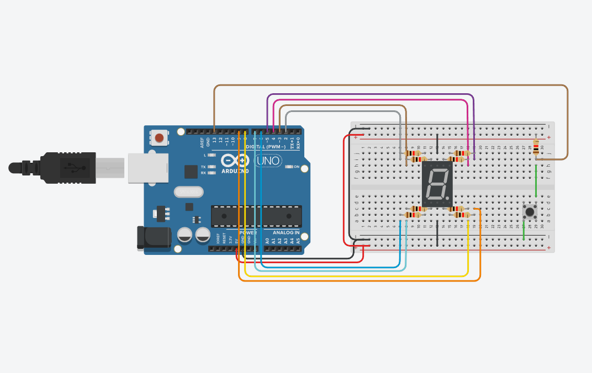

# university_ID_number_circuit

A **first-semester Computer Engineering** project developed in **C++** using the **Arduino IDE**, combining **software** and **hardware** fundamentals through an interactive system. The project features an **Arduino Uno** connected to a **breadboard**, a **push button**, and a **7-segment display**. As the button is pressed, the display presents my **university student ID number** one digit at a time.

This project was developed providing hands-on **experience with digital circuits and hardware prototyping**. It reinforced core engineering concepts such as **input/output control and circuit assembly** while introducing practical problem-solving using the **Arduino** platform.

## 📸 Circuit

## 📸 Schematic view

## 🚀 How to run

1. Open the **Tinkercad** project or download main.ino and build the exact protoboard at home, but that way is kinda hardworking 😅
    
    Tinkercad project: https://www.tinkercad.com/things/d6yTJVR9YbF-id-number?sharecode=m3njArfXaBGyYxcT1AuFvbxM-1DcsunwO7bumNnCQQE

2. Run

## 🛠️ Tech Stack
- Tinkercad
    
    or
- Any Arduino model
- Arduino IDE

## ✨ Features
- C++ Programming logic
- Arduino UNO
- Breadboard
- Logic gates and their part numbers
